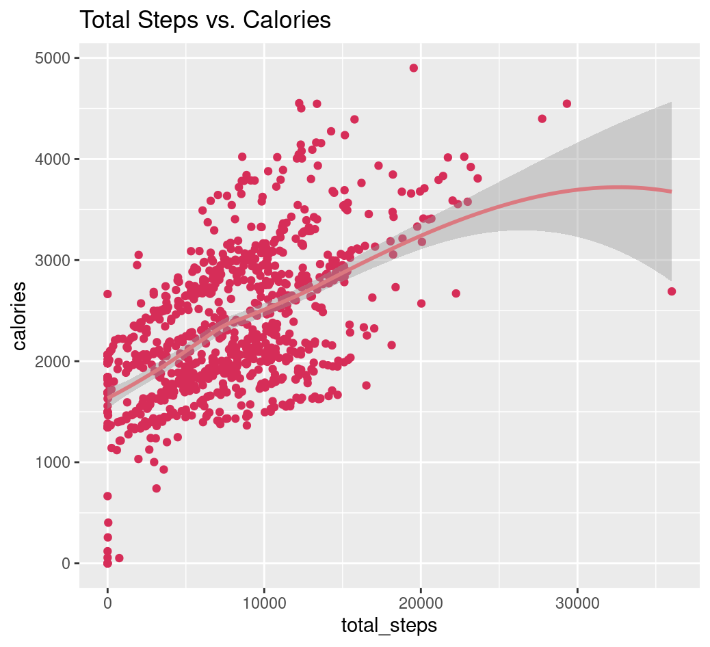
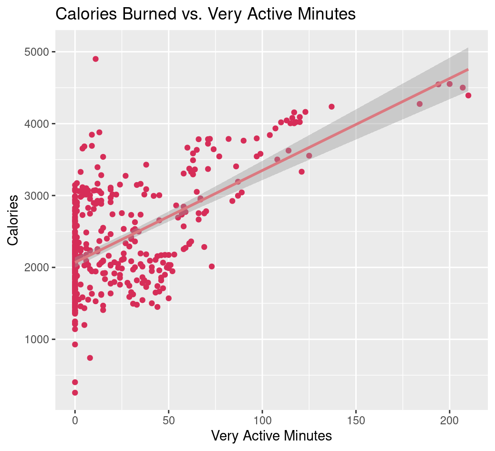
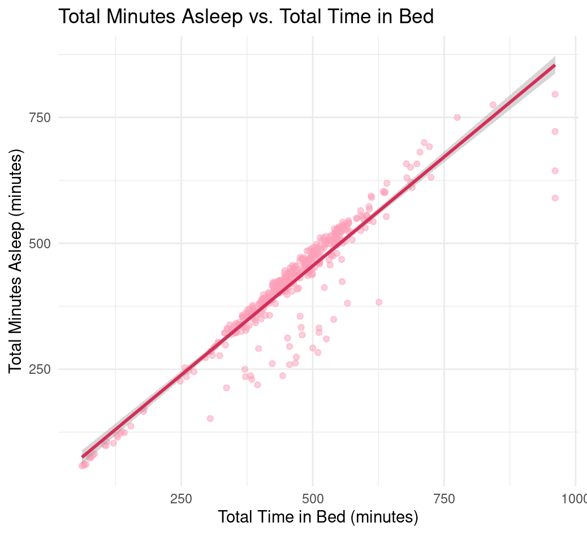
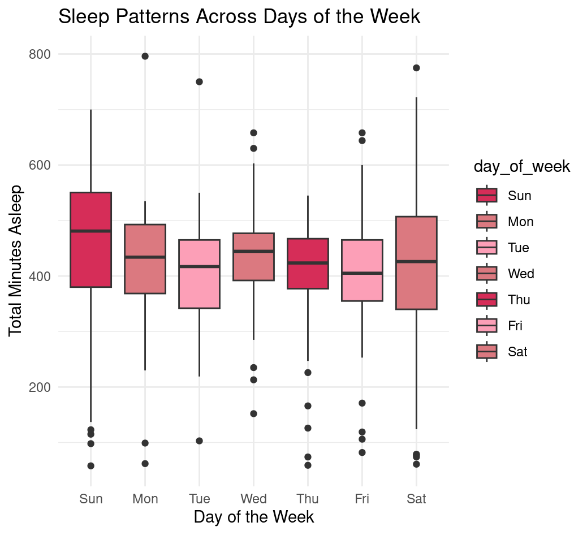
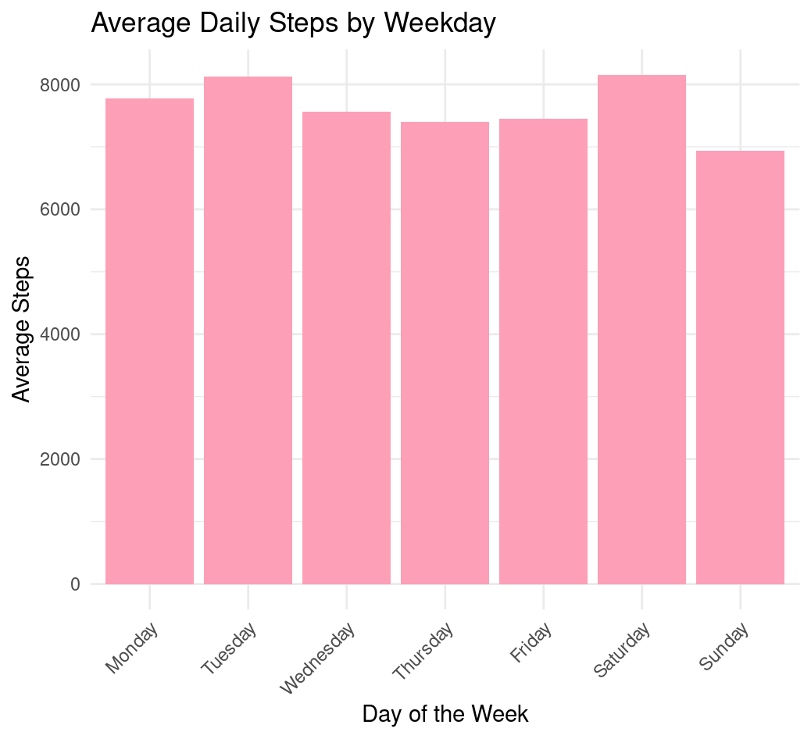
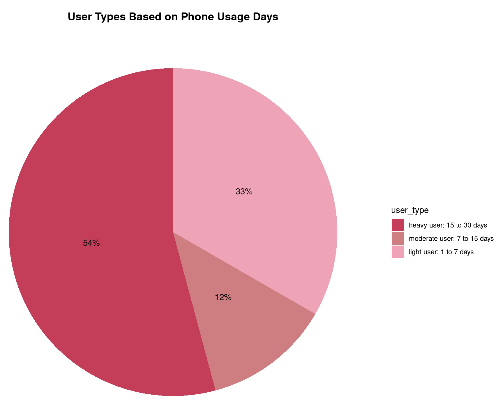

# Fitbit Analysis

Here is an overview of my Capstone Project as a part of the Google Data Analytics Professional Certificate that I have completed. 

We can first get to know the scenario. Bellabeat is a high-tech manufacturer of health-focused products for women. Collecting data on activity, sleep, stress, and reproductive health has allowed the company to empower women with knowledge about their health and habits. I will be focusing on Bellabeat’s app, analyzing smart device data trends to gain insight into how consumers use their smart devices. The results of the analysis will yield growth opportunities and high-level recommendations for the company. 

Let’s dive into each step of the analysis process. 

## PREPARE
### Installing packages :
install.packages("tidyverse")
install.packages("lubridate")
install.packages("dplyr")
install.packages("ggplot2")
install.packages("tidyr")
install.packages("here")
install.packages("skimr")
install.packages("janitor")

### Loading packages :
library(tidyverse)
library(lubridate)
library(dplyr)
library(ggplot2)
library(tidyr)
library(here)
library(skimr)
library(janitor)

### Upload and import dataset to R studio :
Activity <- read.csv("dailyActivity_merged.csv")
Calories <- read.csv("dailyCalories_merged.csv")
Heartrate <- read.csv("heartrate_seconds_merged.csv")
Intensities <- read.csv("dailyIntensities_merged.csv")
Sleep <- read.csv("sleepDay_merged.csv")
Steps <- read.csv("dailySteps_merged.csv")
Weight <- read.csv("weightLogInfo_merged.csv")

### Preview the data :
head(Activity)
head(Calories)
head(Heartrate)
head(Intensities)
head(Sleep)
head(Steps)
head(Weight)

### Preview variables :
colnames(Activity)
colnames(Calories)
colnames(Heartrate)
colnames(Intensities)
colnames(Sleep)
colnames(Steps)
colnames(Weight)

### Check the structure : 
str(Activity)
str(Calories)
str(Heartrate)
str(Intensities)
str(Sleep)
str(Steps)
str(Weight)

## PROCESS
### Check the number of participants for each data set :
n_distinct(Activity$Id)
n_distinct(Calories$Id)
n_distinct(Heartrate$Id)
n_distinct(Intensities$Id)
n_distinct(Sleep$Id)
n_distinct(Steps$Id)
n_distinct(Weight$Id)

### All datasets contain greater than 20 participants except ‘Heartrate’ and ‘Weight’, we can drop these due to insufficient sample size :
rm(Heartrate, Weight)

### Check for missing values :
sum(is.na(Activity))
sum(is.na(Calories))
sum(is.na(Intensities))
sum(is.na(Sleep))
sum(is.na(Steps))

### Check for duplicates :
sum(duplicated(Activity))
sum(duplicated(Calories))
sum(duplicated(Intensities))
sum(duplicated(Sleep))
sum(duplicated(Steps))

### Sleep contains 3 duplicates, we can remove these and recheck for verification :
Sleep <- distinct(Sleep)
sum(duplicated(Sleep))

### Ensure correct name syntax and consistent formatting. Change column names to lowercase :
Activity <- clean_names(Activity)
Activity <- rename_with(Activity, tolower)
Calories <- clean_names(Calories)
Calories <- rename_with(Calories, tolower)
Intensities <- clean_names(Intensities)
Intensities <- rename_with(Intensities, tolower)
Sleep <- clean_names(Sleep)
Sleep <- rename_with(Sleep, tolower)
Steps <- clean_names(Steps)
Steps <- rename_with(Steps, tolower)

### Rename and format dates for consistency : 
Activity <- Activity %>%
rename(date = activity_date) %>%
mutate(date = as_date(date, format = "%m/%d/%Y"))
Calories <- Calories %>%
rename(date = activity_day) %>%
mutate(date = as_date(date, format = "%m/%d/%Y"))
Intensities <- Intensities %>%
rename(date = activity_day) %>%
mutate(date = as_date(date, format = "%m/%d/%Y"))
Sleep <- Sleep %>%
separate(sleep_day, into = c("date", "time"), sep = " ", remove = TRUE)
Sleep <- Sleep %>%
mutate(date = as_date(date, format = "%m/%d/%Y"))
Steps <- Steps %>%
rename(date = activity_day) %>%
mutate(date = as_date(date, format = "%m/%d/%Y"))

## ANALYZE
### Merge the activity and sleep data frames :
Activity_Sleep <- merge(Activity, Sleep, by = c("id", "date"))

### Summarize for trend analysis to aid Bellabeats marketing strategy :
Activity %>%
select (total_steps, total_distance, sedentary_minutes, calories) %>%
summary()
Calories %>%
select (calories) %>%
summary()
Intensities %>%
select (very_active_minutes, fairly_active_minutes, lightly_active_minutes, sedentary_minutes) %>%
summary()
Sleep %>%
select (total_sleep_records, total_minutes_asleep, total_time_in_bed) %>%
summary()
Steps %>%
select (step_total) %>%
summary()
Activity_Sleep %>%
select (total_steps, total_distance, very_active_minutes, lightly_active_minutes, sedentary_minutes, calories, total_sleep_records, total_minutes_asleep, total_time_in_bed ) %>%
summary()

### Use correlation to see how various activities are related : 
cor(Activity_Sleep$total_steps, Activity_Sleep$calories, use = "complete.obs")

### Create correlation matrix to explore more variables :
correlation_matrix <- Activity_Sleep %>%
select(total_steps, total_distance, very_active_minutes, lightly_active_minutes, sedentary_minutes, total_minutes_asleep, total_time_in_bed, calories) %>%
cor(use = "complete.obs")

### Discoveries from summary :
- Total steps daily averages to 7638 . The Centers for Disease Control and Prevention (CDC) recommends walking at least 10,000 steps per day (https://www.cdc.gov/pcd/issues/2016/16_0111.htm) 
- Calories burned daily amounts to 2304 
- Majority of participants appear to be lightly active with high sedentary time 
- Sleep daily amounts to 419 minutes (~7 hours) 
- Sedentary minutes on average is 991 minutes (~17 hours) . This is too high 
- Calories and very active minutes have high correlation 

## SHARE
### Visualize correlation between total steps vs. calories burned :
ggplot(data = Activity, aes(x = total_steps, y = calories)) + 
geom_point(color = "#d62d58") + 
geom_smooth(color = "#db7980") + 
labs(title = "Total Steps vs. Calories")
theme_minimal()

    

### Visualize correlation between calories burned vs. very active minutes :
ggplot(Activity_Sleep, aes(x = very_active_minutes, y = calories)) + 
geom_point(color = "#d62d58") + 
geom_smooth(method = "lm", color = "#db7980") + 
labs(title = "Calories Burned vs. Very Active Minutes", 
x = "Very Active Minutes", 
y = "Calories")

    

### Visualize correlation between total minutes asleep vs. total time in bed : 
visualize_sleep_data <- function(data) {
ggplot(data, aes(x = total_time_in_bed, y = total_minutes_asleep)) +
geom_point(color = "#fc9fb7", alpha = 0.5) +  # Points
geom_smooth(method = "lm", color = "#d62d58") +  # Regression line
labs(title = "Total Minutes Asleep vs. Total Time in Bed", 
x = "Total Time in Bed (minutes)", 
y = "Total Minutes Asleep (minutes)") + 
theme_minimal()  
}

### Call the function to create the plot : 
visualize_sleep_data(Sleep)

    

### Visualize sleep patterns across days of the week : 
Activity_Sleep <- Activity_Sleep %>%
mutate(day_of_week = wday(date, label = TRUE))
ggplot(Activity_Sleep, aes(x = day_of_week, y = total_minutes_asleep, fill = day_of_week)) + 
geom_boxplot() + 
scale_fill_manual(values = c("#d62d58", "#db7980", "#fc9fb7", "#db7980", "#d62d58", "#fc9fb7", "#db7980")) +
labs(title = "Sleep Patterns Across Days of the Week", 
x = "Day of the Week", 
y = "Total Minutes Asleep") +
theme_minimal() 

    

### Visualize average daily steps by weekday :
Steps$date <- as.Date(Steps$date)
Steps <- Steps %>%
mutate(weekday = weekdays(date))
Steps$weekday <- ordered(Steps$weekday, 
levels = c("Monday", "Tuesday", "Wednesday", "Thursday", "Friday", "Saturday", "Sunday"))
weekday_steps <- Steps %>%
group_by(weekday) %>%
summarize(daily_steps = mean(step_total, na.rm = TRUE)) %>%
ggplot(aes(x = weekday, y =daily_steps)) + 
geom_bar(stat = "identity", fill = "#fc9fb7") +
labs(title = "Average Daily Steps by Weekday", 
x = "Day of the Week", 
y = "Average Steps") +
theme_minimal() +
theme(axis.text.x = element_text(angle = 45, hjust = 1)) # Angle for better readability
print(weekday_steps)

    

### Create user type categories based on number of phone usage days :
daily_use <- Activity_Sleep %>%
	group_by(id) %>%
	summarize(total_days_used = n_distinct(date)) %>%
	mutate(user_type = case_when(
		total_days_used <= 7 ~ "light user", 
		total_days_used > 7 & total_days_used <= 15 ~ "moderate user",
		total_days_used > 15 ~ "heavy user"
))

### View the result :
head(daily_use)

### Create percentage data frame for better interpretation :
daily_use_percent <- daily_use %>%
group_by(user_type) %>%
summarize(total = n ()) %>%
mutate(total_percent = total / sum(total),  # Calculate percentages
labels =  scales::percent(total_percent))

### Convert user_type to a factor for better plotting :
daily_use_percent$user_type <- factor(daily_use_percent$user_type, 
levels = c("heavy user", "moderate user", "light user"))

### View the result :
head(daily_use_percent)

### Visualize user type based on phone usage : 
daily_use_percent %>%
	ggplot(aes(x = "", y = total_percent, fill = user_type)) +
	geom_bar(stat = "identity", width = 1) +
	coord_polar("y", start=0) +
	theme_minimal() +
	theme(axis.title.x = element_blank(),
		axis.title.y = element_blank(),
		panel.border = element_blank(),
		panel.grid = element_blank(),
		axis.ticks = element_blank(),
		axis.text = element_blank(),
		plot.title = element_text(hjust = 0.5, size = 14 , face = "bold")) +
	geom_text(aes(label = labels),
		position = position_stack(vjust = 0.5)) +
	scale_fill_manual(values = c("#d62d58", "#db7980", "#fc9fb7"),
		labels = c("heavy user: 15 to 30 days", 
"moderate user: 7 to 15 days", 
"light user: 1 to 7 days")) +
	labs(title = "User Types Based on Phone Usage Days")
 

    

### Conclusions :
- The analysis presents a strong positive correlation between steps and calories burned. Users who are more active and take more steps tend to burn more calories. This insight supports Bellabeat’s activity tracking feature, emphasizing daily step goals to enhance calorie burn 
- Linear trend between minutes asleep and time in bed 
- Half of participants are heavy phone users
- On Tuesdays and Saturday, users reach above 8000 steps on average 

## ACT
### Recommendations for Bellabeat :
- Bellabeat could introduce personalized step and activity goals based on user behavior clusters. For example, users who are part of the low activity/low sleep group could get motivational messages encouraging small increases in activity. High performers could receive more advanced challenges 
- To help users improve their sleep, Bellabeat could consider customized reminders that it’s time to sleep 
- Bellabeat could enhance engagement with weekly reports comparing users’ activity data across weekdays vs. weekends to encourage consistent habits 

